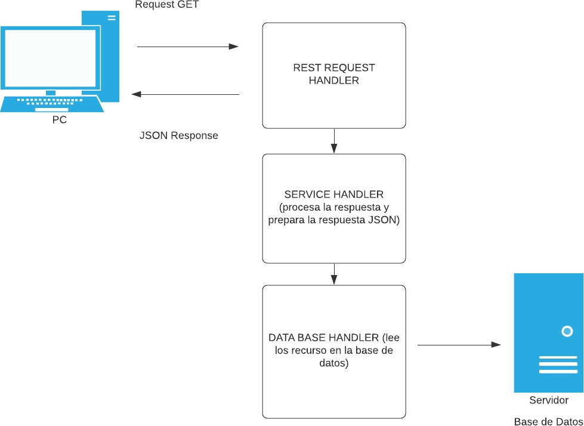
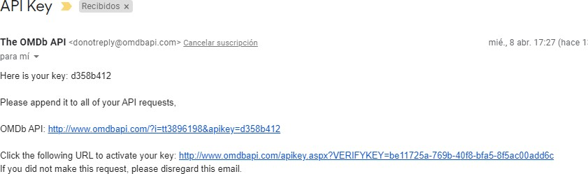
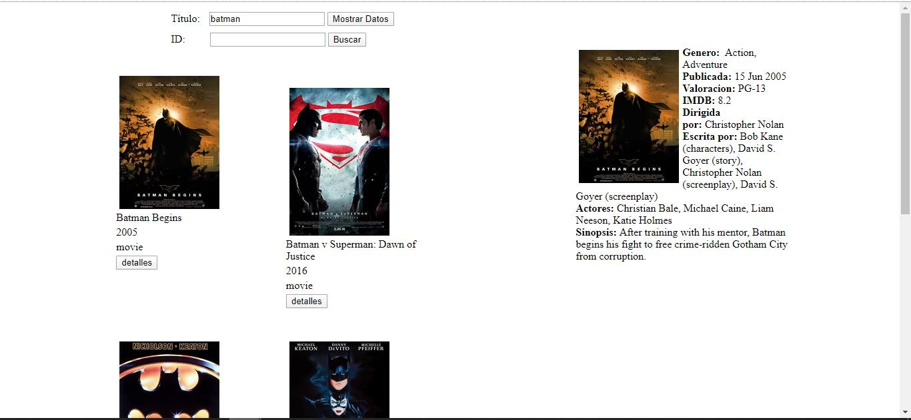
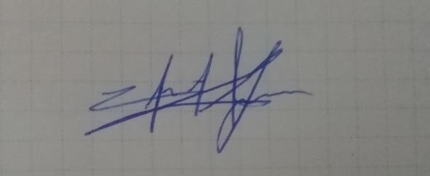

Patrón de diseño : RESTful Web Service

API Key

>   **CONCLUSIONES**: en la practica se pudo constatar de primera mano como es
>   que trabaja este tipo de arquitectura y como las APIs nos ayudan enormamente
>   en el desarrollo de nuestras aplicaciones web, pues si necesitaramos crear
>   un sitio web que requiera una enorme cantidad de datos como las películas no
>   necesitaríamos comenzar dese cero para poder obtener los datos basta con
>   incluir la API en nuestro proyecto.

**Nombre de estudiante: Christian Yunga**

**Firma de estudiante:**
